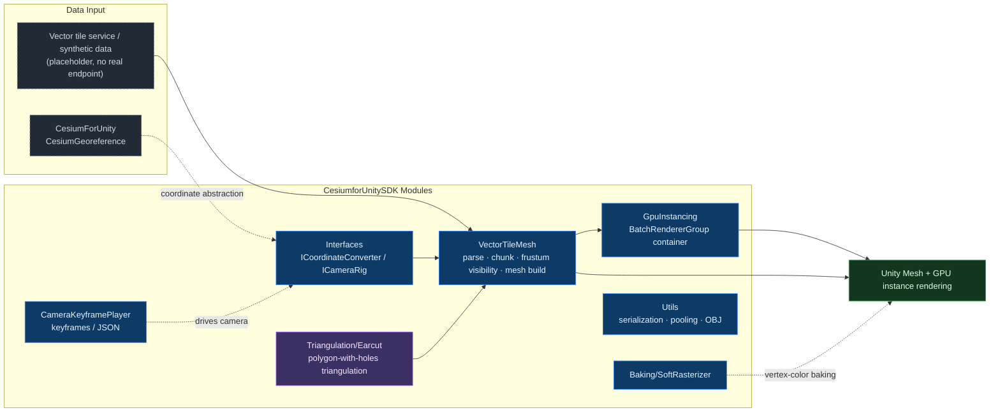

# CesiumforUnitySDK

[中文](README.md) · personal portfolio

    

CesiumforUnitySDK is a personal technical archive for Unity 2022.3 and CesiumForUnity. It collects reusable work around vector-tile mesh generation, GPU instancing, camera keyframe playback, CPU raster baking, and small utilities. It is not a full product and does not include private endpoints, credentials, commercial assets, or business data.

## Architecture



Vector tile data is parsed into meshes by `VectorTileMesh`, then rendered in batches by `GpuInstancing`. Cesium-related coordinate and camera coupling is narrowed into `Interfaces`, making replacement and offline tests easier.

## Highlights

| Module | Role | Key Technology / Dependency |
| --- | --- | --- |
| `GpuInstancing/` | A `BatchRendererGroup` instance container for GPU buffer upload, alignment, and visibility hooks. | BatchRendererGroup, Burst Job, ComputeBuffer |
| `VectorTileMesh/` | Converts building, road, POI, and text vector-tile data into Unity meshes and tracks visible tiles by frustum. | mesh pipeline, jobs, object pools, Cesium coordinate abstraction |
| `Triangulation/Earcut/` | C# port of mapbox earcut for triangulating polygons with holes. | earcut, ISC |
| `CameraKeyframePlayer/` | Runtime camera keyframe recording, editing, playback, and JSON export. | JSON, ICameraRig |
| `Baking/SoftRasterizer/` | CPU raster baking that writes vertex colors to textures with barycentric interpolation. | barycentric interpolation |
| `Utils/` | Binary serialization, lightweight pooling, OBJ export, and other small tools. | Binary IO, object pool, OBJ |

## Preview

| Planned View | File Name (place in `docs/images/`) | Description |
| --- | --- | --- |
| GPU instancing | `gpu-instancing.gif` | Tens of thousands of instances plus camera-frustum culling |
| Vector tiles | `vector-tile-mesh.gif` | Buildings and roads loading dynamically with the camera |
| Camera motion | `camera-keyframe.gif` | Recording and playing camera keyframes |

<!-- Uncomment after adding media:
<p align="center">
  <br/>
  <em>Figure: GPU instancing and camera-frustum culling preview</em>
</p>
-->

## Directory Structure

```text
CesiumforUnitySDK/
├── GpuInstancing/        # BatchRendererGroup instance container
├── VectorTileMesh/       # vector tiles → Unity Mesh
├── Triangulation/Earcut/ # polygon-with-holes triangulation (mapbox earcut, ISC)
├── CameraKeyframePlayer/ # camera keyframe playback
├── Baking/SoftRasterizer/# CPU raster baking
├── Interfaces/           # coordinate / camera abstractions
├── Utils/                # serialization / pooling / OBJ export
├── Samples~/             # synthetic sample data
└── package.json
```

## Installation And Dependencies

1. In Unity Package Manager, choose `Add package from disk...` and select this repository's `package.json`.
2. Install and enable CesiumForUnity first, and make sure the project can reference `CesiumRuntime`.
3. Install the Unity package dependencies declared in `package.json`: `mathematics`, `burst`, `collections`, and `newtonsoft-json`.
4. If you use Cesium ion, provide your token through your own project configuration. This repository only uses the placeholder `YOUR_CESIUM_ION_TOKEN` and does not include credentials.

## Usage Notes

Start with the synthetic data notes in `Samples~/README.md`; do not connect production tile services first. Coordinate conversion and camera control in `VectorTileMesh` are abstracted through `ICoordinateConverter` and `ICameraRig`, so you can replace them with your own Cesium rig or offline test implementation.

The historical typo `InstanceContanier` has been renamed to `InstanceContainer`; update references if you migrate older code.

## Licensing And Sanitization

- Private brand names, internal URLs, real service endpoints, credentials, and business data have been removed.
- `LICENSE` only covers original or rewritten code in this repository.
- CesiumForUnity, earcut, Unity packages, and Newtonsoft Json remain governed by their own licenses. See `THIRD_PARTY_NOTICES.md`.
- See `脱敏复核报告.md` for the sanitization review.

## Related Repositories

These three repositories describe different directions of the same geospatial 3D engineering experience:

- **[CesiumforUnitySDK](https://github.com/zhuxb93/CesiumforUnitySDK)** — Unity / C#, vector-tile rendering and GPU instancing in the Cesium ecosystem.
- [UnityGeoToolkit](https://github.com/zhuxb93/UnityGeoToolkit) — Unity / C#, geospatial editor import framework plus terrain / road / radar tooling.
- [CesiumforUnrealSDK](https://github.com/zhuxb93/CesiumforUnrealSDK) — Unreal / C++, globe camera and vector-tile plugin.

Comparison points: vector-tile rendering (Unity C# ↔ Unreal C++); geospatial coordinate math (`GeoMath` ↔ `CoordinateConverter`); camera motion (keyframe playback ↔ globe camera controller).

## Current Status

The source layout, Chinese module notes, synchronized English README, third-party notices, and sanitization review are complete. The package has not yet been imported and compiled in Unity Editor; run a Unity 2022.3 local package import before production use.
