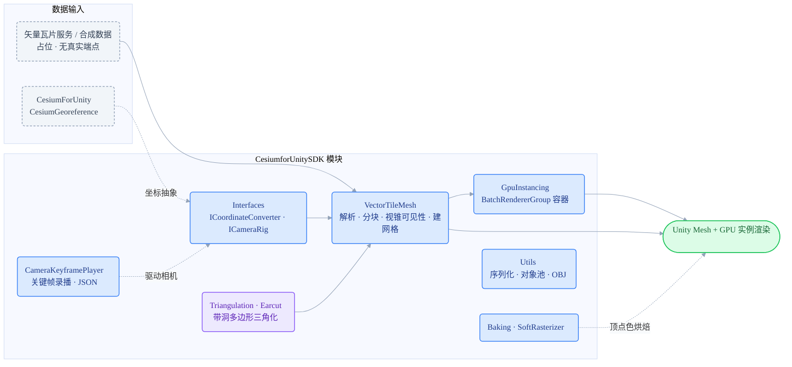

# CesiumforUnitySDK

[English](README.md) · 个人技术积累仓库

    

CesiumforUnitySDK 是一份面向 Unity 2022.3 与 CesiumForUnity 的个人技术积累仓库，整理三维地球场景中常见的矢量瓦片网格化、GPU 实例化、相机关键帧录播、软光栅烘焙和轻量工具。它不是完整产品，不包含真实业务服务、密钥、商业资产或私有数据；目标是把可复用的工程经验沉淀成相对独立的 Unity Package。

## 架构



矢量瓦片数据经 `VectorTileMesh` 解析建网格，`GpuInstancing` 批量渲染；与 Cesium 的坐标和相机耦合统一收敛在 `Interfaces`，便于替换或离线测试。

## 亮点导航

| 模块 | 作用 | 关键技术 / 依赖 |
| --- | --- | --- |
| `GpuInstancing/` | 基于 `BatchRendererGroup` 的实例容器，封装 GPU buffer 上传、窗口对齐、可见性裁剪委托。 | BatchRendererGroup, Burst Job, ComputeBuffer |
| `VectorTileMesh/` | 将建筑、道路、POI、文本等矢量瓦片数据转为 Unity Mesh，并按视锥维护可见瓦片。 | Mesh 管线, Job, 对象池, Cesium 坐标抽象 |
| `Triangulation/Earcut/` | mapbox earcut 的 C# 移植，用于带洞多边形三角化。 | earcut, ISC |
| `CameraKeyframePlayer/` | 运行时录制、编辑、播放相机关键帧，并导出 JSON 运镜数据。 | JSON, ICameraRig |
| `Baking/SoftRasterizer/` | CPU 软光栅化工具，用重心插值把顶点色烘焙到纹理。 | barycentric interpolation |
| `Utils/` | 二进制序列化、轻量对象池、OBJ 导出等常用工程工具。 | Binary IO, object pool, OBJ |

## 预览

| 计划展示 | 文件名（放入 `docs/images/`） | 内容说明 |
| --- | --- | --- |
| GPU 实例化 | `gpu-instancing.gif` | 数万实例渲染 + 相机视锥裁剪 |
| 矢量瓦片 | `vector-tile-mesh.gif` | 建筑 / 道路瓦片随相机动态加载 |
| 相机运镜 | `camera-keyframe.gif` | 录制关键帧并播放运镜 |

<!-- 补图后取消注释：
<p align="center">
  <br/>
  <em>图：GPU 实例化与相机视锥裁剪预览</em>
</p>
-->

## 目录结构

```text
CesiumforUnitySDK/
├── GpuInstancing/        # BatchRendererGroup 实例容器
├── VectorTileMesh/       # 矢量瓦片 → Unity Mesh
├── Triangulation/Earcut/ # 带洞多边形三角化 (mapbox earcut, ISC)
├── CameraKeyframePlayer/ # 相机关键帧录播
├── Baking/SoftRasterizer/# CPU 软光栅烘焙
├── Interfaces/           # 坐标 / 相机抽象接口
├── Utils/                # 序列化 / 对象池 / OBJ 导出
├── Samples~/             # 合成数据示例
└── package.json
```

## 安装与依赖

1. 在 Unity Package Manager 中选择 `Add package from disk...`，指向本目录的 `package.json`。
2. 先安装并启用 CesiumForUnity，确保工程可以引用 `CesiumRuntime`。
3. 安装 `package.json` 中声明的 Unity 官方依赖：`mathematics`、`burst`、`collections`、`newtonsoft-json`。
4. 如需使用 Cesium ion，请在自己的项目配置中提供 token。示例只使用 `YOUR_CESIUM_ION_TOKEN` 占位，不内置任何密钥。

## 使用建议

先从 `Samples~/README.md` 里的合成数据说明开始，不要直接接入生产瓦片服务。`VectorTileMesh` 中的坐标转换和相机控制已经通过 `ICoordinateConverter`、`ICameraRig` 抽象，方便替换成你自己的 Cesium rig 或离线测试实现。

历史文件名 `InstanceContanier` 已统一更名为 `InstanceContainer`；如从旧代码迁移，需要同步更新引用。

## 许可与脱敏

- 仓库已移除私有品牌命名、内网地址、真实服务端点、密钥和业务数据。
- `LICENSE` 仅覆盖本人原创和改写部分。
- CesiumForUnity、earcut、Unity 官方包和 Newtonsoft Json 等第三方依赖按各自许可使用，详情见 `THIRD_PARTY_NOTICES.md`。
- 复核记录见 `脱敏复核报告.md`。

## 相关仓库

同一套地理三维工程经验的三个方向，可对照阅读：

- **[CesiumforUnitySDK](https://github.com/zhuxb93/CesiumforUnitySDK)** — Unity / C#，Cesium 生态下的矢量瓦片渲染与 GPU 实例化。
- [UnityGeoToolkit](https://github.com/zhuxb93/UnityGeoToolkit) — Unity / C#，地理编辑器导入框架与地形 / 路网 / 雷达工具链。
- [CesiumforUnrealSDK](https://github.com/zhuxb93/CesiumforUnrealSDK) — Unreal / C++，地球相机与矢量瓦片插件。

对照点：矢量瓦片渲染（Unity C# ↔ Unreal C++ 双实现）；地理坐标数学（`GeoMath` ↔ `CoordinateConverter`）；相机运镜（关键帧录播 ↔ 地球相机控制器）。

## 当前状态

本仓已完成源码整理、中文模块说明、英文同步文档、第三方许可清单和脱敏复核。尚未在 Unity Editor 中完成真实导入编译，公开使用前建议先在 Unity 2022.3 工程中跑一轮本地包导入验证。
